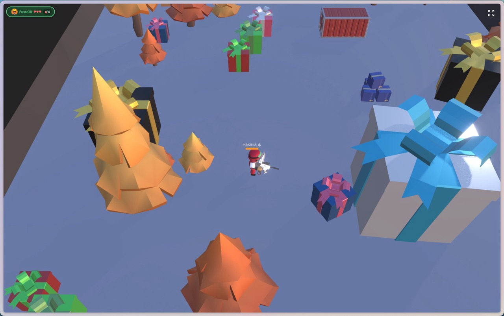

# Christmas Death Match 🎄

A festive multiplayer 3D arena shooter built with React Three Fiber and Playroom Kit. Battle it out in a Christmas-themed arena where players join via their phones and compete on the big screen!



## Features

- **Christmas Theme**: Festive visuals with snowfall, decorations, and holiday cheer
- **Dual Controls**: Play with on-screen joystick (mobile) or keyboard (desktop)
- **Real-time Multiplayer**: Powered by Playroom Kit for seamless multiplayer experience
- **3D Physics**: Built with React Three Rapier for realistic physics
- **Post-processing Effects**: Bloom effects and soft shadows for visual polish
- **Adaptive Performance**: Automatically adjusts quality for lower-end devices

## Tech Stack

- [React Three Fiber](https://docs.pmnd.rs/react-three-fiber) - React renderer for Three.js
- [React Three Drei](https://github.com/pmndrs/drei) - Useful helpers for R3F
- [React Three Rapier](https://github.com/pmndrs/react-three-rapier) - Physics engine
- [Playroom Kit](https://joinplayroom.com/) - Multiplayer infrastructure
- [Vite](https://vitejs.dev/) - Build tool

## Quick Start

```bash
yarn install
yarn dev
```

## Using Just

This project includes a [Justfile](https://github.com/casey/just) for common tasks:

```bash
# List all available commands
just

# Install dependencies
just install

# Start development server
just dev

# Build for production
just build

# Preview production build
just preview

# Update dependencies
just update
```

## How to Play

1. Start the development server
2. Open the game URL on a big screen/TV - this becomes the "stream screen"
3. Players scan the QR code or enter the room code on their phones
4. Control your character:
   - **Mobile**: Use the on-screen joystick to move and tap the fire button to shoot
   - **Desktop/Keyboard**: Use **WASD** keys to move and **SPACE** to fire
5. Battle it out and check the leaderboard for scores!

### Game Flow

- **Countdown Screen**: When the game launches, a festive countdown appears (5...4...3...2...1...GO!) with Christmas decorations and snowfall. Desktop players will see keyboard control hints displayed on either side of the screen.
- **Battle Phase**: Players compete in the arena, shooting opponents to eliminate them. The leaderboard tracks remaining lives.
- **Winner Screen**: When only one player remains, a celebratory Christmas-themed victory screen announces the winner with their avatar, name, and festive decorations.

## Deployment

This project is configured for deployment on [Deno Deploy](https://deno.com/deploy). Build the production assets with:

```bash
yarn build
```

The built files will be in the `dist` directory.

## Acknowledgments

This project is heavily based on the [r3f-shooter-game example](https://github.com/asadm/playroom-docs/tree/main/examples/r3f-shooter-game) from the Playroom Kit documentation. Many thanks to the original authors for providing such a solid foundation to build upon.

## License

See [LICENSE](LICENSE) for details.
